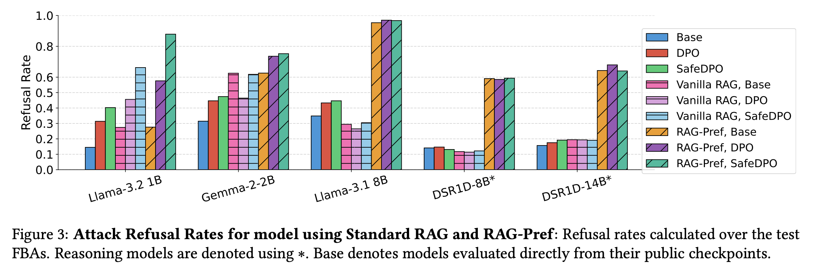

# MCP Safety Training

[](https://arxiv.org/abs/2505.23634)
[](https://arxiv.org/abs/2605.11217)
[](https://huggingface.co/datasets/johnhalloran/mcp-fbas)
[](LICENSE)

Companion code for:

- Halloran, John. "MCP Safety Training: Learning to Refuse Falsely Benign MCP Exploits using Improved Preference Alignment." arXiv:2505.23634 (2025).
- Halloran, John T. "Leveraging RAG for Training-Free Alignment of LLMs." arXiv:2605.11217 (2026).

DPO / SafeDPO training and evaluation code for aligning tool-using LLMs against **falsely-benign MCP exploits (FBAs)** — CVE-derived Model Context Protocol tool-use attacks phrased as ordinary, harmless-sounding requests.

## Results

No safety-tuned model (1B–14B params) refused more than 35% of FBAs out of the box. Standard DPO/SafeDPO alignment only pushed that to 48% at best. RAG-Pref, the training-free retrieval-based method proposed alongside this code, gets ~3x refusal-rate improvement alone and ~3.7x combined with DPO/SafeDPO — see arXiv:2505.23634 and arXiv:2605.11217 for full numbers.



*Figure from arXiv:2605.11217. All bars shown are implemented in this repo: `Base`/`DPO`/`SafeDPO` via `dpo.py`/`safedpo.py`/`mcp_test_cache.py`, `Vanilla RAG`/`RAG-Pref` via `make_rag_dbs.py`/`rag_pref.py` (see [Safety Alignment Methods](#safety-alignment-methods)).*

## Safety Alignment Methods

- [x] DPO / SafeDPO training + evaluation
- [x] OPAD (on-the-fly, training-free principle-guided decoding)
- [x] RAG-Pref (training-free retrieval-based alignment)
- [x] Vanilla RAG baseline (`rag_pref.py --vanilla-rag`)

## Contents

| File | Purpose |
|---|---|
| `dpo.py` | Standard DPO training entry point (TRL's `DPOTrainer`), 4-bit QLoRA. |
| `safedpo.py` | SafeDPO training entry point; swaps in `SafeDPOTrainer` for TRL's `DPOTrainer`. |
| `safedpo_trainer.py` | `SafeDPOTrainer`, a `DPOTrainer` subclass adding a safety-penalty term for preference pairs flagged `better_is_unsafe`/`worse_is_unsafe`, and a `"safedpo"` loss type. |
| `opad.py` | On-the-fly, training-free principle-guided contrastive decoding ([OPAD](https://github.com/stevie1023/OPAD)), optionally layered on top of a DPO/SafeDPO PEFT checkpoint. |
| `opad_dataset.py` | `Principle` class (system-prompt principles OPAD conditions on) and related dataset wrappers, adapted from OPAD. |
| `opad_utils.py` | Decoding helpers (top-p filtering, log-prob extraction) adapted from OPAD. |
| `make_rag_dbs.py` | Builds the attack/benign vector DBs RAG-Pref retrieves from, using [`golden`](https://github.com/johnhalloran321/golden). Run once before `rag_pref.py`. |
| `rag_pref.py` | RAG-Pref: retrieves similar attack/benign examples at generation time and injects them into the system prompt, optionally layered on top of a DPO/SafeDPO PEFT checkpoint. |
| `mcp_test_cache.py` | Generates model responses to attack/benign eval prompts, optionally loading a PEFT adapter checkpoint. |
| `mcp_judge_cache.py` | Scores generated responses for refusal via a two-stage judge pipeline. |
| `my_jailbreak_classifiers.py` | Refusal/jailbreak judge classifiers (`Llama3Guard1BJailbreakJudge`, `Llama3RefusalJudge`, `Llama3JailbreakJudge`, `StringClassifier`), adapted from JailbreakBench. |
| `tools.py` | MCP filesystem tool descriptions injected into the system prompt. |
| `prompt.py` | Builds the system prompt listing available tools. |

## Data

Training and evaluation data is the MCP Falsely-Benign Attack (FBA) & Truly-Benign (TB) Preference Dataset: **[johnhalloran/mcp-fbas](https://huggingface.co/datasets/johnhalloran/mcp-fbas)**. It has three configs:

| Config | Split | Rows | Use |
|---|---|---|---|
| `default` | `train` | ~2.6k | DPO/SafeDPO preference pairs (chosen/rejected), half FBA + half TB |
| `test_attack` | `test` | 109 | Held-out FBA prompts, for refusal-rate evaluation |
| `test_benign` | `test` | 171 | Truly-benign prompts, for checking over-refusal |

```python
from datasets import load_dataset
train_ds  = load_dataset("johnhalloran/mcp-fbas", "default", split="train")
attack_ds = load_dataset("johnhalloran/mcp-fbas", "test_attack", split="test")
benign_ds = load_dataset("johnhalloran/mcp-fbas", "test_benign", split="test")
```

## Installation

Requires a CUDA GPU (flash-attention capable), access to the dataset above, and Python 3.11.

```bash
conda create -n mcp-safety python=3.11 -y
conda activate mcp-safety

# install torch matching your CUDA toolkit first
pip install torch==2.6.0 --index-url https://download.pytorch.org/whl/cu126

pip install -r requirements.txt

# flash-attn must be built against the already-installed torch, in its own step
pip install flash-attn==2.7.4.post1 --no-build-isolation

huggingface-cli login   # required to pull the gated mcp-fbas dataset / push trained models
```

`requirements.txt` includes [`golden`](https://github.com/johnhalloran321/golden) (installed directly from GitHub — it isn't on PyPI), the retrieval package `make_rag_dbs.py`/`rag_pref.py` depend on. If you only need DPO/SafeDPO/OPAD, you can skip it; RAG-Pref won't run without it.

## Training

`dpo.py` and `safedpo.py` both hardcode the `mcp-fbas` `default`/`train` config as the training set, 4-bit-quantize the base model, wrap it in a LoRA adapter, and train through TRL's argument surface (`HfArgumentParser((ScriptArguments, DPOConfig, ModelConfig))`), so any standard `DPOConfig`/`ModelConfig` CLI flag applies. `--dataset_name` is still a required flag (part of TRL's `ScriptArguments`) but is only used for the Hub dataset name if `--push_to_hub` is set — any placeholder value works. `safedpo.py` additionally takes `--loss_type safedpo` and derives `better_is_unsafe`/`worse_is_unsafe` labels itself via `dataset.map(...)`: any `chosen` response equal to the fixed refusal string is labeled `worse_is_unsafe=True` (the attack/refusal pairs), everything else `False`.

Both scripts are launched with `accelerate`, which handles device placement across whichever GPUs `CUDA_VISIBLE_DEVICES` exposes. Name `--output_dir` so it can be picked back up as the `--peft-checkpoint` in evaluation (see below) — this repo's convention is `${prefix}-${model_shortname}`, e.g. `mcp-fbas-dpo-Llama-3.1-8B-Instruct`:

```bash
export CUDA_VISIBLE_DEVICES=0,1,2,3   # however many GPUs you have available

d="meta-llama"
o="Llama-3.1-8B-Instruct"
loss="dpo"
prefix="mcp-fbas-${loss}"
output="${prefix}-${o}"

accelerate launch dpo.py \
    --dataset_name "mcp-fbas" \
    --model_name_or_path="${d}/${o}" \
    --per_device_train_batch_size 1 \
    --num_train_epochs 15 \
    --learning_rate 5e-7 \
    --lr_scheduler_type=cosine \
    --gradient_accumulation_steps 1 \
    --logging_steps 10 \
    --eval_steps 500 \
    --output_dir=${output} \
    --warmup_ratio 0.1 \
    --report_to tensorboard \
    --bf16 \
    --optim "adamw_torch" \
    --logging_first_step \
    --use_peft \
    --load_in_4bit \
    --lora_target_modules=all-linear \
    --lora_r=16 \
    --lora_alpha=16
```

`safedpo.py` takes the same invocation (swap `dpo.py` for `safedpo.py`), with `--loss_type safedpo` added.

**Single GPU:** no separate code path is needed. Set `CUDA_VISIBLE_DEVICES` to a single device and just invoke the python file directly — `accelerate launch` is not required for single-GPU runs:

```bash
export CUDA_VISIBLE_DEVICES=0
python3 dpo.py \
    --dataset_name "mcp-fbas" \
    --model_name_or_path="${d}/${o}" \
    --per_device_train_batch_size 1 \
    ...   # remaining flags unchanged
```

## Evaluation

Evaluation is a two-stage pipeline, run per trained checkpoint. `mcp_test_cache.py`/`mcp_judge_cache.py` run as plain single-process `python3` (no `accelerate launch`) — the `transformers` pipeline they use handles device placement itself via `device_map="auto"`. The `--peft-checkpoint` passed in must match the `--output_dir` used at training time:

```bash
export CUDA_VISIBLE_DEVICES=0

d="meta-llama"
loss="dpo"
bs=60     # batch size, adjust according to your GPU memory bandwidth
retries=10

o="Llama-3.1-8B-Instruct"
prefix="mcp-fbas-${loss}"
p="${prefix}-${o}"                       # must match training's --output_dir
m="${d}/${o}"
attack="${o}_${prefix}_attack_output.json"
benign="${o}_${prefix}_benign_output.json"

# 1. generate responses on the held-out attack (FBA) prompts
python3 mcp_test_cache.py --pretrained-dir ${m} \
    --peft-checkpoint ${p} \
    --output ${attack} \
    --batch-size ${bs} \
    --retries ${retries}

# 2. generate responses on the truly-benign prompts (checks over-refusal)
python3 mcp_test_cache.py --pretrained-dir ${m} \
    --peft-checkpoint ${p} \
    --output ${benign} \
    --batch-size ${bs} \
    --check-benign \
    --retries ${retries}

# 3. judge both sets of responses for refusal and report rates
python3 mcp_judge_cache.py \
    --stage2 \
    --benign-responses "${benign}" \
    --attack-responses "${attack}" | tee "${o}-${prefix}-scores.txt"

```

`mcp_judge_cache.py` first scores every response with `ProtectAI/distilroberta-base-rejection-v1`, then (via `--stage2`) re-checks disputed cases with an LLM judge from `my_jailbreak_classifiers.py` (`Llama3RefusalJudge`); add `--store-refusals` to also dump the per-response judgments to disk. Output is strict/majority/average refusal and acceptance rates, per `retries` attempt, for both the attack and benign sets.

## OPAD (on-the-fly, training-free decoding)

`opad.py` is a training-free alternative to DPO/SafeDPO: at generation time it contrasts a "with-principle" system prompt against a "no-principle" one and reweights token probabilities accordingly, optionally layered on top of a DPO/SafeDPO PEFT checkpoint via `--peft-checkpoint`.

```bash
export CUDA_VISIBLE_DEVICES=0

m="meta-llama/Llama-3.1-8B-Instruct"
p="mcp-fbas-dpo-Llama-3.1-8B-Instruct"   # optional PEFT checkpoint; drop --peft-checkpoint to run OPAD on the base model alone

# 1. attack prompts
python3 opad.py \
    --model_path "${m}" \
    --peft-checkpoint "${p}" \
    --principle_id 0 \
    --temperature 0.5 \
    --ratio 3.0 \
    --retries 10 \
    --batch-size 10 \
    --output attack_output.json

# 2. benign prompts
python3 opad.py \
    --model_path "${m}" \
    --peft-checkpoint "${p}" \
    --principle_id 0 \
    --temperature 0.5 \
    --ratio 3.0 \
    --check-benign \
    --retries 10 \
    --batch-size 10 \
    --output benign_output.json

# 3. judge for refusal
python3 mcp_judge_cache.py \
    --stage2 \
    --benign-responses benign_output.json \
    --attack-responses attack_output.json
```

`--ratio` controls the contrastive strength between the principle-guided and unguided decoding passes; `--principle_id` selects which principle to condition on from `opad_dataset.Principle`.

## RAG-Pref (retrieval-augmented, training-free alignment)

RAG-Pref retrieves similar attack and benign examples at generation time and injects them into the system prompt as contrastive context, rather than fine-tuning the model. It needs vector DBs built once up front with `make_rag_dbs.py` (via [`golden`](https://github.com/johnhalloran321/golden)), then `rag_pref.py` retrieves from them at generation time — same two-stage eval as the other methods.

```bash
export CUDA_VISIBLE_DEVICES=0

# 1. one-time setup: build the retrieval DBs (./mcp_attack_db, ./mcp_benign_db)
python3 make_rag_dbs.py

# 2. generate responses, retrieving context from those DBs at each step
m="meta-llama/Llama-3.1-8B-Instruct"
p="mcp-fbas-dpo-Llama-3.1-8B-Instruct"   # optional PEFT checkpoint; drop --peft-checkpoint to run RAG-Pref on the base model alone
bs=10
retries=10

python3 rag_pref.py --pretrained-dir "${m}" \
    --peft-checkpoint "${p}" \
    --output attack_output.json \
    --batch-size ${bs} \
    --retries ${retries}

python3 rag_pref.py --pretrained-dir "${m}" \
    --peft-checkpoint "${p}" \
    --output benign_output.json \
    --batch-size ${bs} \
    --check-benign \
    --retries ${retries}

# 3. judge for refusal
python3 mcp_judge_cache.py \
    --stage2 \
    --benign-responses benign_output.json \
    --attack-responses attack_output.json | tee "${m##*/}-rag_pref-scores.txt"
```

`make_rag_dbs.py` only needs to be run once per corpus (it persists all DBs to disk); re-run it if the underlying `mcp-fbas` training data changes. `--top-k` on `rag_pref.py` controls how many retrieved examples are injected into context per query (default 2).

### Vanilla RAG baseline

`--vanilla-rag` switches `rag_pref.py` to the naive RAG baseline RAG-Pref is compared against: a single retrieval pool of benign examples  (`./mcp_benign_db`) and a vanilla system prompt lacking contrastive instructions. Same invocation as RAG-Pref, plus the flag:

```bash
python3 rag_pref.py --pretrained-dir "${m}" \
    --peft-checkpoint "${p}" \
    --vanilla-rag \
    --output attack_output.json \
    --batch-size ${bs} \
    --retries ${retries}

python3 rag_pref.py --pretrained-dir "${m}" \
    --peft-checkpoint "${p}" \
    --vanilla-rag \
    --output benign_output.json \
    --batch-size ${bs} \
    --check-benign \
    --retries ${retries}

python3 mcp_judge_cache.py \
    --stage2 \
    --benign-responses benign_output.json \
    --attack-responses attack_output.json | tee "${m##*/}-vanilla_rag-scores.txt"
```

## Citation

```bibtex
@article{halloran2025mcpsafety,
  title   = {MCP Safety Training: Learning to Refuse Falsely Benign MCP Exploits using Improved Preference Alignment},
  author  = {Halloran, John},
  journal = {arXiv preprint arXiv:2505.23634},
  year    = {2025}
}

@article{halloran2026ragpref,
  title   = {Leveraging RAG for Training-Free Alignment of LLMs},
  author  = {Halloran, John},
  journal = {arXiv preprint arXiv:2605.11217},
  year    = {2026}
}
```

Dataset: [johnhalloran/mcp-fbas](https://huggingface.co/datasets/johnhalloran/mcp-fbas) (CC BY-NC 4.0).

## License

The code in this repository is licensed under the **Apache License 2.0** (see [LICENSE](LICENSE)). `dpo.py`, `safedpo.py`, and `safedpo_trainer.py` are derivative works of [HuggingFace TRL](https://github.com/huggingface/trl), also Apache 2.0.

Note this is separate from the dataset's license: **[johnhalloran/mcp-fbas](https://huggingface.co/datasets/johnhalloran/mcp-fbas) is CC BY-NC 4.0** (non-commercial, attribution required). The code license does not extend any rights to the data — check the dataset card before using it outside research/non-commercial contexts.
